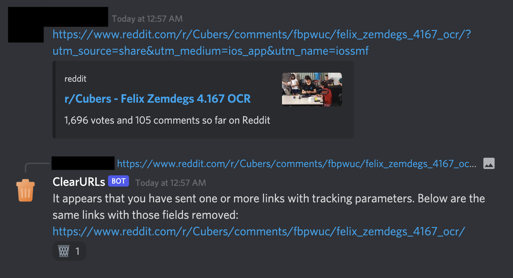

# ClearURLs Discord Bot
A Discord bot that uses ClearURLs to automatically strip out tracking parameters from messages with links.

[Add to your server using this link.](https://discord.com/api/oauth2/authorize?client_id=840669072420634696&permissions=76864&scope=bot) Warning: I cannot make any uptime guarantees beyond what is offered by the free tier of Replit and UptimeRobot. Contact me if you would like to sponsor a more reliable hosting plan.

## Permissions
The bot's permissions system is designed to be granular, minimal, and gracefully degrade in the absence of those unnecessary for basic function.

- *Read Messages* and *Send Messages* are **required** to perform the cleaning.
- *Manage Messages* is **recommended** so the bot can suppress embeds on its own links to reduce visual clutter.
- *Read Message History* and *Add Reactions* are **optional** for the original poster to easily delete the bot's replies with the `:wastebasket:` emoji.