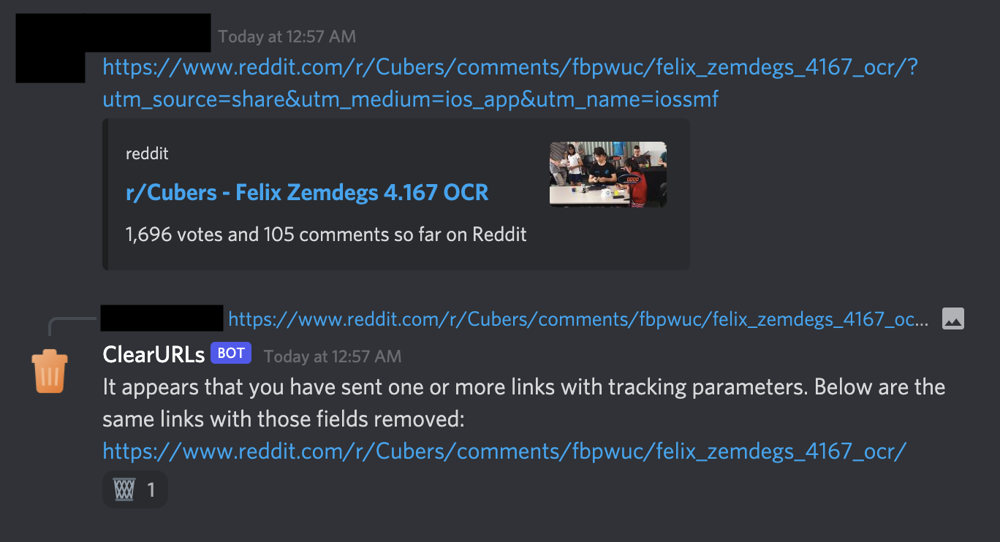

<h1 align="center">ClearURLs Discord Bot</h1>

	
	 
	<a href="https://danielzting.github.io/clearurls-discord-bot/start">Click here to add to your server!</a>

Have you ever noticed those `utm` and `fbclid` snippets in links? Those are used to track your activity and unnecessary for the site to work. This bot uses the [Unalix](https://github.com/AmanoTeam/Unalix) library that is based off of the popular [ClearURLs](https://github.com/ClearURLs/Addon) browser extension to automatically strip out such parameters from links. This keeps URLs short and readable while enhancing the privacy of your server's members.

Disclaimer: This public instance is hosted on my Raspberry Pi and I make no guarantees of uptime or performance.

## Permissions
The bot's permissions system is designed to be granular, minimal, and gracefully degrade in the absence of those unnecessary for basic function.

- *Read Messages* and *Send Messages* are **required** to perform the cleaning.
- *Manage Messages* is **recommended** so the bot can suppress embeds on its own links to reduce visual clutter.
- *Read Message History* and *Add Reactions* are **optional** for the original poster to easily delete the bot's replies with the `:wastebasket:` emoji. Note that these two permissions are on by default for `@everyone`. If you want to disable react-to-remove, turn off these permissions for `@everyone` and give every human in your server a new role. This functionality also **requires** *Manage Messages* for deletion.

## Self-Hosting
It is very straightforward to host this yourself. If you do, I would love to know!

1. Download the repository with `git clone https://github.com/DanielZTing/clearurls-discord-bot`
2. Get dependencies with `pip install -r requirements.txt`
3. Set up a new application at the [Discord Developer Portal](https://discord.com/developers/applications)
4. Add a bot and check the `bot` scope and the above permissions in the OAuth2 tab
5. Visit the generated link to invite the bot
6. Copy the token from the Bot tab and paste `TOKEN=[your clipboard here]` into a file named `.env`
7. Run with `python main.py`

## Privacy Policy
I collect zero information.
